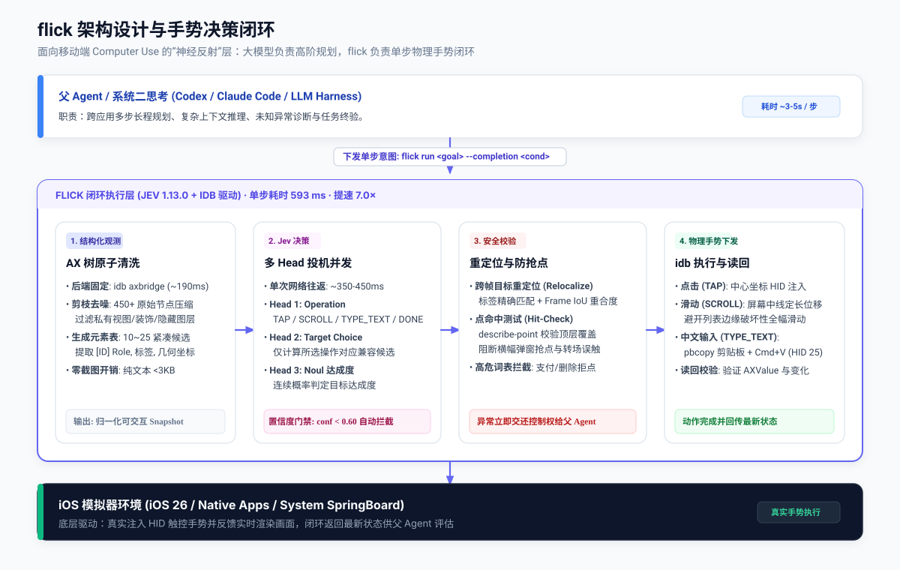

# flick ⚡

<p align="center">
  
</p>

**A fast iOS simulator agent with a dynamic, indexed action space.**

Give it one micro-goal. [TypeSafe's Jev](https://typesafe.ai) picks an operation and an element. The simulator executes via [Facebook idb](https://github.com/facebook/idb). Built as a sub-second "reflex layer" for parent coding agents (Codex, Claude Code) driving mobile UIs.

**593 ms per decision cycle.** Zero screenshots in the loop, 7× faster than frontier LLMs, with calibrated probabilities on every action.

---

## The action space

Every observation produces a cleaned, indexed element table from the iOS accessibility tree:

```text
[1] Button       General                  · uid=com.apple.settings.general
[2] Button       Accessibility            · uid=com.apple.settings.accessibility
[3] SearchField  Search                   · value=Search
[4] Switch       Airplane Mode            · value=0
...
```

The operations are `TAP`, `TYPE_TEXT`, `SCROLL_UP`, `SCROLL_DOWN`, `WAIT`, `DISMISS_MODAL`, `DONE`, and `BLOCKED`. Only valid operations and targets are offered.

```text
                                one TypeSafe request
                               ┌───────────────────────────┐
screen → cleaned AX elements ──▶ operation                 │
                               │ tap_target                │
                               │ type_target, if present   │
                               │ goal_satisfied (noul)     │
                               └─────────────┬─────────────┘
                                   use the matching target
                                             │
                              TAP [1] ───────┤──→ describe-point & tap
                          TYPE_TEXT [3] ─────┘
                                    ↓
                              simctl pbcopy + Cmd+V paste
```

Target questions are speculative. If the operation is `TAP`, only `tap_target` executes. Two decisions, **one network round trip**.

Model output never becomes arbitrary selectors, raw coordinates, or blind taps. Every target is resolved from an observed element and validated before execution.

---

## Try it

```bash
# 1. Clone & install
git clone https://github.com/szupzj18/flick.git
cd flick
uv sync

# 2. Build standalone binary (zero Python dependency)
uv run python -m PyInstaller --noconfirm --clean --onefile --name flick main.py
cp dist/flick ~/.local/bin/flick

# 3. Observe the current booted simulator
export IDB_UDID="<your-simulator-udid>"
flick observe
```

---

## Single-step agent execution

`flick run` is the primary entrypoint for LLM agent loops. It executes a single bounded action and returns structured observations for the calling LLM to plan the next step:

```bash
flick run "Tap General" \
  --completion "General settings page with About row is visible" \
  --api-key "$TYPESAFE_API_KEY"
```

**JSON Output:**
```json
{
  "status": "success",
  "action_taken": "Executed TAP on 'General'",
  "page_changed": true,
  "goal_satisfied_probability": 0.04,
  "current_screen": {
    "front_app": "Preferences",
    "elements": [
      {
        "index": "1",
        "role": "Button",
        "label": "About",
        "value": "",
        "operations": ["TAP"]
      }
    ],
    "page_text": "Settings\nGeneral\nAbout..."
  }
}
```

For text input, pass `--text`. It is safely pasted via `simctl pbcopy` and verified on readback:
```bash
flick run "Enter search query" \
  --completion "Search field contains query" \
  --text "Hello World"
```

---

## Why it moves

- **One request per decision cycle.** Operation, target heads, and completion noul share the same observed state in a single payload.
- **No screenshots in the agent loop.** Jev consumes structured accessibility state (~3 KB per screen). No multimodal vision tokens, no image uploads.
- **Atomic AX snapshot.** Reads visible controls, names, roles, values, and coordinates in one `axbridge` call (~190 ms). Private chrome, duplicate shadow labels, and off-screen nodes are stripped before inference.
- **Validate the target before input.** Prior to tapping, `flick` relocalizes the target in the fresh frame and verifies `describe-point(x, y)` matches the target label. Accidental banner clicks and navigation race conditions are rejected.
- **Unicode-safe text entry.** Bypasses `idb ui text`'s ASCII-only keycode limitation by writing to the simulator pasteboard and triggering keyboard shortcuts, verifying the resulting `AXValue` on readback.
- **Calibrated confidence gates.** Returns native continuous probabilities (0.0–1.0). If confidence falls below 0.60 or a sensitive keyword (pay, delete, erase) is detected, execution aborts and escalates to the parent model.

---

## Benchmark: flick vs LLM

Evaluated on real native iOS application interfaces (12 to 24 interactive controls, deep scroll views):

| Metric | flick (Jev 1.13.0) | Frontier LLM (Gemini 3.8 Flash) | Notes |
|---|---:|---:|---|
| **Average End-to-End Latency** | **593.8 ms** | 4143.4 ms | **7.0× faster** |
| **Operation Accuracy** | **90.0% (9/10)** | **90.0% (9/10)** | Matched accuracy |
| **Target Accuracy** | 90.0% (9/10) | **100.0% (10/10)** | |
| **Overall Task Success** | **90.0% (9/10)** | **90.0% (9/10)** | |
| **Gesture Semantics (Scroll)** | **Correct (`SCROLL_UP`)** | Inverted (`SCROLL_DOWN`) | LLM confused colloquial "scroll down" with touch gesture |
| **Continuous Confidence** | **Yes (0.0–1.0)** | None (autoregressive text) | Direct probability gate for safe aborts |
| **Format Error Risk** | **Zero (Typed API)** | JSON parse / schema drift | |

---

## Small enough to read

The entire codebase is ~700 lines of Python:

| File | Job |
|---|---|
| [cli.py](flick/cli.py) | CLI commands (`run`, `observe`, `dump`, `shot`) |
| [observer.py](flick/observer.py) | Atomic AX tree snapshot, element pruning, relocalization |
| [model.py](flick/model.py) | Multi-head choice questions & probability validation |
| [executor.py](flick/executor.py) | Relocalization, hit-checks, safe dispatch, and escalation |
| [device.py](flick/device.py) | Simulator bridge, CJK pasteboard, and HID gestures |

---

## Limits

- **Simulators only**: idb accessibility inspection relies on private Simulator bridge interfaces; physical devices are not supported.
- **Accessibility dependent**: Custom views without accessibility traits (e.g. Flutter without semantics, Unity/Metal games) are not visible to the observer.
- **Complex gestures out of scope**: Long press, pinch-to-zoom, drag-and-drop, and slider adjustments are rejected at the operation gate.

---

## License

[MIT](LICENSE)
