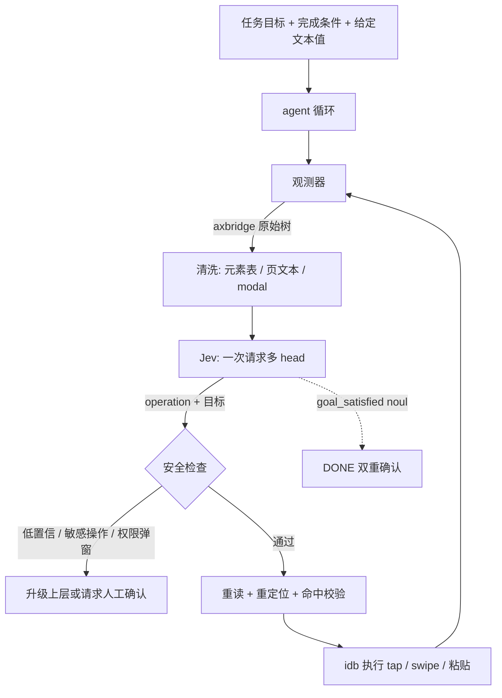
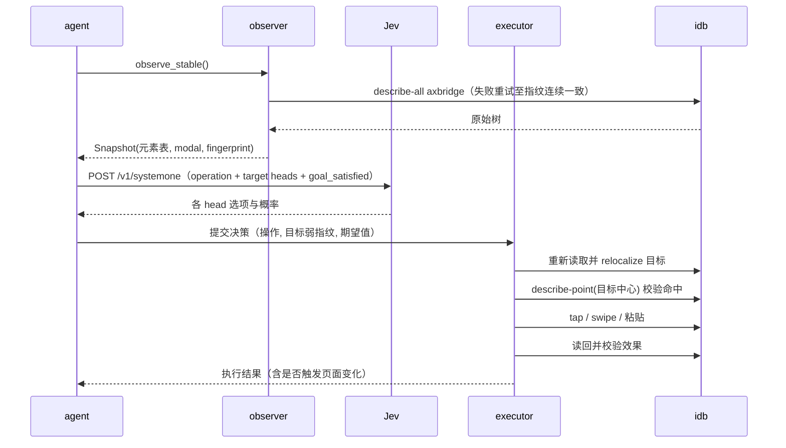

# flick 设计文档

## 1. 目标与结论

flick 让 agent 操作 iPhone 模拟器。每一步由 TypeSafe Jev 在固定选项中选出操作和目标元素，由 idb 在模拟器上执行手势。Jev 的输入是辅助功能树清洗后的文本元素表，不含截图；需要输入文字时，文本内容来自任务给定值或独立的小模型。

项目开源仓库：[szupzj18/flick (GitHub)](https://github.com/szupzj18/flick)

系统适用范围：模拟器内的原生 app 操作、跨 app 流程、系统设置与权限弹窗。项目当前完成观测器、Jev 决策、安全执行器及独立 CLI 工具的封装。

核心设计约束来自三项实测事实（iOS 26 模拟器，idb v1.6.1，2026-09 实测）：

- idb 的 `axbridge` 后端单次全屏读取约 0.2 秒，旧 `ax` 后端在 SwiftUI 设置首页返回 15 个元素，axbridge 返回 132 个。读取后端固定为 axbridge。
- idb 每次返回全新字典树，节点没有跨帧稳定句柄，第三方 app 的 `AXUniqueId` 普遍缺失。目标在执行前必须重新定位。
- `idb ui text` 只支持 ASCII 键码，中文直接报错，ASCII 空格被键盘本地化成 U+2006。文本输入统一走模拟器剪贴板粘贴并读回校验。

## 2. 系统总览



组件与代码对应关系：

| 组件 | 模块 | 状态 | 职责 |
|---|---|---|---|
| 设备封装 | `flick/device.py` | 已完成 | idb/simctl 调用、开机检测、读取重试、手势、粘贴、截图 |
| 观测器 | `flick/observer.py` | 已完成 | 树清洗、元素表、modal 提取、稳定读取、跨帧重定位 |
| 决策层 | `flick/model.py`（待建） | 里程碑 2 | 构造多 head choice 请求、校验概率分布、完成度 noul |
| 安全执行器 | `flick/executor.py`（待建） | 里程碑 3 | 重读重定位、describe-point 命中校验、执行、读回 |
| 循环控制 | `flick/agent.py`（待建） | 里程碑 4 | tick 调度、预算、卡死检测、升级策略 |

单步时序：



## 3. 观测层

### 3.1 读取后端与稳定性

读取固定使用 `idb ui describe-all --json --api axbridge`。app 启动转场期间读取经历三个阶段：报错（guest reader 注入失败）、元素数漂移、约 2.7 秒后稳定。`observe_stable()` 对瞬态错误重试，并要求连续两次清洗结果指纹一致才返回，总等待上限 12 秒。模拟器关机时读取同样报瞬态错误，由 `ensure_booted()` 在循环开始前检测并开机。

### 3.2 元素表清洗

原始树的噪声占比高：设置页 165 个节点中 100 个无 label，包含分隔线、装饰视图、滚动条、cell 的 shadow 文本节点和屏外元素。清洗规则：

- **保留**：role 或 traits 表明可交互的节点（Button、Cell、Link、Switch、CheckBox、TextField、TextView、SearchField、Slider 等）。
- **剔除**：私有实现类（类型名含 ScrollIndicator、Separator、Decoration、HostingView、InheritedView、DimmingView 等）、无 frame、宽高小于 4 点、超出屏幕范围 8 点以上的节点。
- **去重**：相同 label 且 frame 量化后相同的多个节点，保留交互性最强的一个（Button/Cell 优先于内部文本和图片）。
- **label 取值顺序**：AXLabel、title、placeholder、help、role_description。
- **屏内 StaticText** 按位置排序后拼成 `page_text`，供决策和完成判断使用。

实测清洗结果：

| 屏幕 | 原始节点 | 清洗后元素 | 说明 |
|---|---:|---:|---|
| 设置首页 | 165 | 13 | 系统 cell 保留语义 uid，如 `com.apple.settings.general` |
| 主屏 SpringBoard | 278 | 13 | 图标节点类型为 `Icon`，uid 被 label 回填，同屏有重名（小组件与图标同名） |
| 提醒事项首页 | 81 | 15 | 含无 label 容器 cell（保留 uid，标注为不可优先目标） |
| 提醒事项编辑页 | 95 | 含 2 个 TYPE_TEXT 目标 | 标题、备注输入框识别正确 |
| Safari（example.com） | 102 | 链接与按钮可用 | 网页节点为 `WebAccessibilityObjectWrapper`，重复节点和滚动条噪声多 |

每个元素输出字段：`index`、`role`、`label`、`value`、`frame`、`center`、`traits`、`uid`、`enabled`、`operations`（TAP/TYPE_TEXT/ADJUST）。

### 3.3 modal 提取

Alert、Sheet、ActionSheet 以及 `_UIPopoverDimmingView`（label 为"关闭弹出式窗口"）从动作候选中移除，单独放在 `Snapshot.modal`。实测中系统 app 首次启动连续出现欢迎页和 iCloud 同步卡片，弹窗属于常规状态。modal 存在时决策层的可选操作收窄为点击弹窗内按钮或关闭弹层。

### 3.4 跨帧重定位

目标在决策时以 `(label, role, frame, uid)` 描述，执行前在新帧中重新匹配：

1. label 完全相同的元素；若无，退化为双向子串匹配；
2. 多个候选时取 frame 重叠面积最大者；
3. 全部失败则本次决策作废，重新观测与决策，不执行任何手势。

这是弱指纹方案。重名列表项（邮件、消息列表）依赖 frame 重叠和 uid 区分，可靠性低于 DOM 节点引用，因此执行前叠加 describe-point 命中校验（见 5.2）。

## 4. 决策层

### 4.1 一次请求多 head

沿用 jev-ultrafast 的结构：一次 systemone 调用包含一个 operation head 和每种操作各自的 target head，全部 head 基于同一份屏幕状态并行作答，代码只允许被选中的那个 target head 生效。

`state` 字段：

```json
{
  "front_app": "Preferences",
  "elements": [
    {"index": "3", "role": "Button", "label": "通用",
     "value": "", "operations": ["TAP"]},
    {"index": "11", "role": "SearchField", "label": "搜索",
     "value": "", "operations": ["TAP", "TYPE_TEXT"]}
  ],
  "page_text": "设置 …（屏内静态文本，限 6000 字符）",
  "recent_actions": [{"action": "tap 设置行", "page_changed": true}]
}
```

问题集：

| head | 类型 | 选项 |
|---|---|---|
| `operation` | choice | TAP、TYPE_TEXT、SCROLL_UP、SCROLL_DOWN、WAIT、DONE、BLOCKED；modal 存在时增加 DISMISS_MODAL，移除滚动类 |
| `tap_target` | choice | 所有带 TAP 操作的元素（含弹窗按钮） |
| `type_target` | choice | 所有带 TYPE_TEXT 操作的元素 |
| `goal_satisfied` | noul | 当前屏幕是否已可见地满足任务全部要求 |

操作规则（`questions.py`）依据 iOS 实测改写 Web 版规则：输入前先处理遮挡键盘和弹窗；列表项点击后等待新页面稳定；开关已处于目标状态时不重复操作；WAIT 只用于控件缺失或内容加载中，连续 WAIT 不计为加载证据；DONE 要求屏内出现完成条件指定的证据。

响应校验沿用 Web 版：选项集合必须与请求一致、概率之和误差小于 0.2、choice 必须是概率最大项。校验失败时不执行任何动作，重新观测。

### 4.2 完成判定

DONE 需要两个条件同时成立：operation head 选中 DONE，且 `goal_satisfied` noul 概率不低于 0.8。任务创建时必须带可观测的完成条件（例如"出现 label 包含'已存储'的元素"、"开关 value 为打开状态"），没有完成条件的任务在创建时拒绝执行。

### 4.3 目标数量与两级选择预案

一屏可交互元素为 13–80 个。Jev 公开评测的选项规模为 3–20 个，40 个以上选项的准确率没有外部数据。里程碑 2 用离线录屏评测确定 head 形式：

- top-1 准确率不低于 0.85 且 ECE 不高于 0.15：采用单级 head；
- 不达标：改为两级，第一个 head 先选屏幕区域（导航栏、列表、键盘、弹窗、底部工具栏），第二个 head 在区域内选元素，级联两次请求。

## 5. 执行层

### 5.1 手势与操作集

| 操作 | idb 调用 | 说明 |
|---|---|---|
| TAP | `ui tap x y --api hid` | 坐标为元素 frame 中心点，单位 points |
| SCROLL_UP/DOWN | `ui swipe` 屏幕中线起手固定距离 | 不用元素级 scroll，其惯性距离不可控 |
| WAIT | 本地等待 0.5 秒后重新观测 | |
| DISMISS_MODAL | 点 modal 内关闭按钮或 dimming 区域 | |
| TYPE_TEXT | 见第 6 节 | |

长按、拖拽、滑块、滚轮 picker、双指手势在 MVP 中不提供，遇到需要这类手势的状态由 operation 选 BLOCKED 并升级。系统按钮已验证支持 `HOME/LOCK/SIDE_BUTTON/SIRI/APPLE_PAY`（`ui button`）。任务启动时先按 HOME 再 launch app，实测 `launch --foreground` 只把已有进程带到前台，不重置导航栈，app 可能停在上次的子页面。

水平滑动在列表行上有破坏性语义：位移超过行宽的左滑会直接执行该行的首个破坏性操作（实测提醒事项全幅左滑直接删除，无确认弹窗）。执行器的竖向滚动手势固定 x 坐标在屏幕中线，水平位移类手势不提供给模型，只允许在明确标注的行上按固定短位移执行。

### 5.2 执行前安全链

一次决策从选择到执行经过以下检查，任一失败即作废重来：

1. **重读**：重新稳定观测，对比 fingerprint；
2. **重定位**：relocalize 找到目标当前帧位置；
3. **命中校验**：`describe-point(x, y)` 返回的元素 label/frame 与目标一致，防止通知横幅、弹窗、转场遮罩抢点；
4. **敏感操作检查**：label 命中发送、删除、支付、购买、登录、授权、关机等词表的目标，不自动执行，升级上层确认；
5. **决策单次消费**：决策在执行前置空，任何异常路径都不会让同一个 tap 重试两次。

变更类手势不重试。idb 近期提交（"Prove a rejected tap opened nothing without polling for 30s"）表明社区正在补这方面能力，后续版本可直接复用其拒点检测。

### 5.3 执行后读回

执行记录先写入历史，再重新观测。后处理：

- 页面 fingerprint 未变化计入连续无效果次数；
- TYPE_TEXT 读回目标元素 AXValue 做包含校验；
- 连续三次动作无页面变化且非 WAIT，置为 BLOCKED；
- 单次 tick 失败允许重新走一遍观测与决策，不允许重复执行同一手势。

## 6. 文本输入

`idb ui text` 的两个实测缺陷使其不可直接使用：非 ASCII 字符抛 "No keycode found" 异常；ASCII 空格被替换成 U+2006。统一输入路径：

1. TAP 目标输入框，等待 0.5 秒；
2. `xcrun simctl pbcopy <udid>` 写入文本，`idb ui key 25 --command` 发送 Cmd+V（idb 使用 USB HID 键码，V 为 25；修饰键 Command 为 227）；
3. 重新读取，检查目标元素 AXValue 包含期望文本（空白字符做归一化比较）；
4. 校验失败则放弃本轮（不重试粘贴），报 BLOCKED 并附带读回值。读回值可能带粘贴产生的尾部换行，比较前做首尾空白裁剪。

辅助功能树不暴露输入焦点，无法在粘贴前确认焦点位置，因此第 3 步的读回校验是唯一的成功判据。

文本值的来源分两期：

- MVP：任务在创建时给出确定值（对应 jev-desktop 的 textSlots），agent 不自行生成；
- 后续：TYPE_TEXT 选中后调用 OpenAI 兼容的小模型生成值（沿用 jev-ultrafast 的 `field_text`），要求返回 `{"text": ...}`，无法从任务推断时返回 null。

`idb ui set-value` 直接改 AX 值，不触发键盘输入和控件事件，表单的联动逻辑可能不执行，只在无事件依赖的场景作为后备，默认路径不使用。

## 7. 升级条件与预算

以下情况停止自动循环并上报：

| 情况 | 检测方式 | 处置 |
|---|---|---|
| 决策不确定 | operation 或选中 target 的置信度低于 0.6（阈值由里程碑 2 校准） | 上报候选分布，请求上层决策 |
| 敏感控件 | label 命中敏感词表，或 modal 是系统权限请求 | 等待人工确认 |
| 目标失效 | relocalize 失败、describe-point 不一致，连续两轮 | BLOCKED |
| 无进展 | 连续三次动作页面无变化 | BLOCKED |
| 预算用尽 | 60 个动作或 120 次 Jev 调用 | BLOCKED |
| 环境异常 | axbridge 持续报错超过 12 秒、模拟器关机恢复失败 | 报错退出 |

## 8. 离线评测与主流模型对比（里程碑 2）

在接入真机执行前，项目通过离线评测评估 Jev 决策机制在 iOS 复杂界面下的准确率与时延表现。评测包含两个阶段：多场景微评测与复杂原生界面下的专项 LLM 对照测试。

### 8.1 基础微评测（系统应用与 Safari）

初期验证覆盖设置、提醒事项、Safari 及主屏幕共 7 个典型任务样本：

| 指标 | 准确率 / 分值 |
|---|---|
| Operation Acc | 71.4% (5/7) |
| Target Acc | 75.0% (3/4) |
| Noul Acc (DONE判定) | 100.0% (7/7) |
| Operation ECE | 0.1543 |

*注：Target Acc 分母为 4，因 `WAIT`、`DONE` 等操作不需要定位 Target。*

### 8.2 典型原生复杂界面专项对照评测：flick (Jev 1.13.0) 对比 LLM (gemini-3.8-flash)

在典型高复杂度原生界面（包含授权弹窗、400+ 原始节点的综合信息流、横向滑动栏与底部导航栏）中采集快照，并在 10 个具有代表性的交互任务上对比 flick（Jev 1.13.0 系统一模型）与通用大语言模型（gemini-3.8-flash，zero-shot JSON 结构化动作输出）：

| 评估指标 | flick (Jev 1.13.0) | LLM (gemini-3.8-flash) | 差值与说明 |
|---|---|---|---|
| **平均端到端时延** | **593.8 ms** | 4143.4 ms | flick 快 7.0 倍（Jev 单步决策多数在 430~500 ms 间） |
| **操作类型准确率 (Operation)** | **90.0% (9/10)** | **90.0% (9/10)** | 命中率相同 |
| **目标元素准确率 (Target)** | 90.0% (9/10) | **100.0% (10/10)** | 详见下方错例分析 |
| **综合任务成功率** | **90.0% (9/10)** | **90.0% (9/10)** | 两者在 10 个测试任务中各错 1 题 |
| **平均输入 Tokens** | 3163.5 | 967.4 | Jev 采用多 Head 并行评估结构，输入体积较大 |
| **平均输出 Tokens** | 267.4 | 127.9 | Jev 输出包含各 Head 的概率分布矩阵 |
| **确定性概率与置信度** | **支持 (0.0~1.0 连续分布)** | 不支持 (自回归纯文本输出) | Jev 自带置信度与概率归一，便于运行时拦截 |
| **输出格式解析故障风险** | **零风险 (Typed API)** | 存在 (依赖 JSON 字符串提取) | Jev 由后端协议强约束，无幻觉字段 |

### 8.3 错例机理分析

对照实验中两者各出现一次预测偏差，原因如下：

1. **手势物理方向理解（任务：向上划动屏幕浏览下方更多信息流内容）**
   - **flick (Jev)**：输出 `SCROLL_UP`（正确）。Jev 严格依据系统规则（"Swipe upward to reveal lower content"）做出选择，与 iOS 底层物理手势语义对齐。
   - **LLM**：输出 `SCROLL_DOWN`（错误）。大模型按日常概念中的“向下浏览”混淆了物理滑动手势方向。
2. **任务完成态判定与导航入口偏好（任务：进入应用主页）**
   - **LLM**：输出 `DONE`（正确）。检测到当前页面本身即为主页，直接给出完成。
   - **flick (Jev)**：输出 `TAP` 底部第 20 号元素“首页”Tab 按钮（置信度 0.93）。Jev 将意图“进入主页”优先解释为点击界面现存的“首页”物理入口，而非原地判定完成。对于进入目标界面的任务，当且仅当目标入口不可见或已处于激活态时，DONE 概率才会上升。

## 9. 适用范围与非目标

适用范围：

- iOS 模拟器（idb 的辅助功能读取依赖模拟器私有接口，真机不可用）；
- UIKit 与 SwiftUI 原生 app；系统 app 与提供标准 accessibility 标注的第三方 app；
- 单台设备串行执行。

明确不支持：

- 真机、多设备并行调度；
- 网页内操作：模拟器 WebView 的辅助功能树质量低于桌面 CDP 直接读取 DOM，网页任务用桌面浏览器方案；
- 无辅助功能内容的界面（多数游戏、关闭 semantic 的 Flutter/自绘界面）；
- 复杂手势（长按、拖拽、滑块、picker、双指）；
- 支付、发送、删除等后果不可逆的确认动作（只能升级，不能自动执行）。

## 10. 里程碑

| 里程碑 | 内容 | 验收标准 | 状态 |
|---|---|---|---|
| 1 | 观测器 | 真实屏幕稳定读取，清洗结果人工核对正确；9 个离线测试通过 | 已完成 |
| 2 | 离线判别评测 | 30 个以上标注屏幕，确定单级或两级 head；置信度阈值校准 | 骨架完成与微评测验证 |
| 3 | 安全执行器 | 竞争注入下误点率 0；文本粘贴读回闭环；已在 CLI `flick run` 完成集成 | 已完成 |
| 4 | agent 循环 | 设置与备忘录两条端到端任务通过，含弹窗处置与完成判定 | 待开始 |
